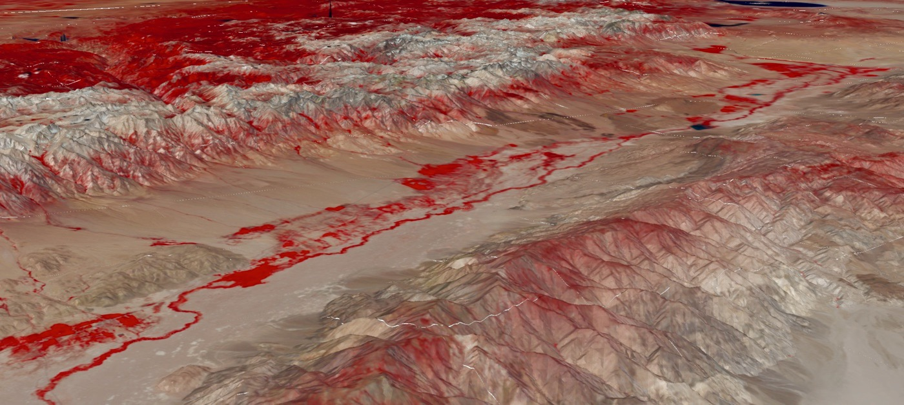

# landsat8.earth

2D/3D WebGL-powered Landsat 8 satellite imagery analysis

3D, False-color Infrared Landsat visualization of the Eastern Sierra

## Overview

Landsat8.earth is an application to explore [Landsat 8][landsat8] imagery in the
browser using [WebGL][webgl] (via [deck.gl][deck.gl]).

The backend runs on AWS Lambda and is powered by [Cloud-Optimized
GeoTIFFs][cogeo], a fast cloud-native file format that enables streaming
portions of raster images. It draws from the huge repository of Landsat 8 data
[publicly available on S3][landsat8-aws], thanks to the AWS Open Data program.

- [`landsat-mosaic-tiler`][landsat-mosaic-tiler] is the backend; a Python
  application running on AWS Lambda, and serves Landsat imagery on demand.
- [`landsat-cogeo-mosaic`][landsat-cogeo-mosaic] is used to pregenerate mosaics
  (collections) of Landsat images, enabling a visualization of many images at
  once.
- [`landsat-mosaic-latest`][landsat-mosaic-latest] keeps an updated Landsat
  mosaic, allowing for the option of viewing the latest available imagery.
- [`deck.gl-raster`][deck.gl-raster] handles the analysis of Landsat data in WebGL.

[landsat8]: https://www.usgs.gov/land-resources/nli/landsat/landsat-8?qt-science_support_page_related_con=0#qt-science_support_page_related_con
[webgl]: https://developer.mozilla.org/en-US/docs/Web/API/WebGL_API
[deck.gl]: https://deck.gl
[cogeo]: https://cogeo.org
[landsat8-aws]: https://registry.opendata.aws/landsat-8/

[landsat-mosaic-tiler]: https://github.com/kylebarron/landsat-mosaic-tiler
[landsat-cogeo-mosaic]: https://github.com/kylebarron/landsat-cogeo-mosaic
[landsat-mosaic-latest]: https://github.com/kylebarron/landsat-mosaic-latest
[deck.gl-raster]: https://github.com/kylebarron/deck.gl-raster/

### Credits

Icon used as website favicon made by <a href="https://www.flaticon.com/authors/freepik" title="Freepik">Freepik</a> from <a href="https://www.flaticon.com/" title="Flaticon">www.flaticon.com</a>

